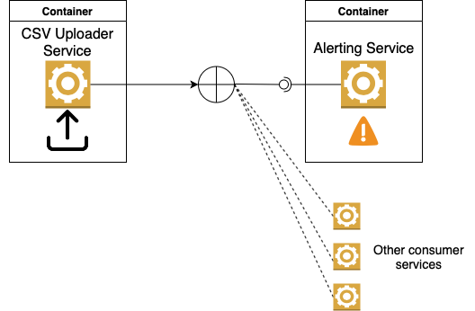

Architecture playground 
#### Requirements:

1. Provide a REST API where the user can upload a CSV file with bank statements. 
Take into account that this file can be huge (hundreds of MBs).
Please check sample [payload](statements.csv).

2. Provide an alert system that detects transactions over 10000 EUR. For this technical challenge purpose, 
You can simply print the alert to the console as:

* Input:

```
transaction_id,description,value,date
7a43bc25-924f-4c3d-bb1f-82eb1f42fbc5,Mycompany Salary,3000.00,2019-09-01
fe29b2cc-8393-4463-96ec-a9a740b30b61,Lemonade hut,-5.00,2019-09-02
b58ecf2c-f4d8-4e5b-ba4f-70a92898198c,Weird transaction,-10025.00,2019-09-04
e94109ac-4028-41f2-b4fb-6e4e2f80dbaa,Monthly rent,-850.00,2019-09-04
f31f7e82-4109-4d3d-9647-c1a85d437d3b,Train tickets,-10.00,2019-09-08
```

* Alert Output:
```
Found transaction over alert threshold:
description: Weird transaction,
value: -10025.00,
date: 2019-09-04
```

#### Technical Requirements

1. The solution should have separate services to implement each of the business requirements.
2. The solution should have a 3rd component that allows communication between the CSV reader service and the Alerting service.
3. Also, this component should have the capability to integrate more consumers other than the Alerting system (check the Image below). 
For example, maybe in the future another service will also consume the statements and persist them in a database. 
4. All components should run on containers.
5. Provide a mechanism for the solution to be started and used on localhost.




